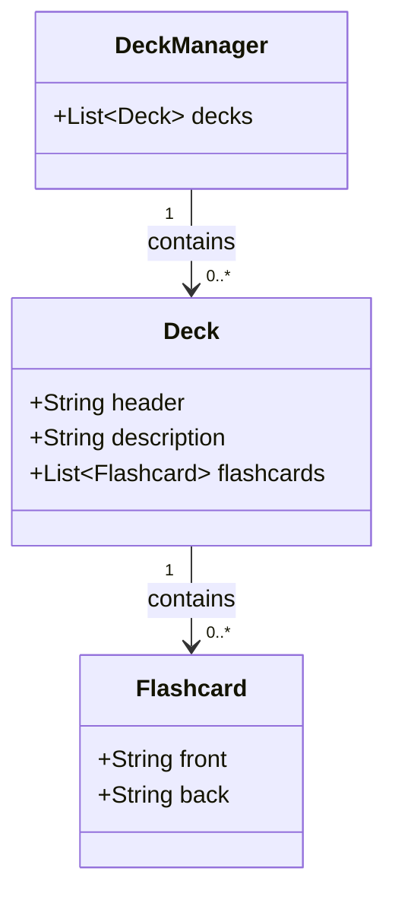

# Project Plan

## Functional Requirements

These are the requirements set by the course instructor. They are the minimum requirements that must be met for the project to be considered complete. I've simply translated them from Finnish to English.

* `UR-1`: The user can create flashcard decks that contain cards. A deck has a name and an optional description.
* `UR-2`: The user can add cards to a flashcard deck. A card has a term and an explanation (front and back side).
* `UR-3`: The user can browse and edit the added flashcard decks.
* `UR-4`: The user can practice the cards of a deck in a "practice mode". In practice mode, the user is shown the term of a single card. The user can view the explanation of the card by "flipping" the card. After that, the user can move to the next or previous card.
* `UR-5`: In practice mode, the cards are always displayed in a random order.
* `UR-6`: The user can edit and delete flashcard decks or their individual cards.

### Extension Requirements (Nice-to-haves)

The Game Stats and Exam Mode features are not required for the project, but are set by the course instructor as optional extension requirements. If I end up adding any of my own, I will add them under a separate "Additional Extension Requirements" heading.

#### Game Stats

* `ER-1`: Add a view count for each card. Each time the user reveals a card's explanation in practice mode, the card's view count increases by one.
* `ER-2`: Card view counts are shown in the card table in the deck edit view.
* `ER-3`: Add a practice count for each deck. Each time the user opens practice mode and practices every card in the deck once, the deck's practice count increases by one.
* `ER-4`: Deck practice counts are shown in the main view as a separate column.

#### Exam Mode

* `ER-5`: Add an exam mode for decks. In exam mode, the user is shown the term of one card and three possible explanations as a multiple-choice question. The user must choose the explanation that matches the term. The user is then shown the correct answer as feedback, after which the next multiple-choice question is displayed.
* `ER-6`: Exam mode must work equally well for a deck with three cards and for a deck with several hundred cards.
* `ER-7`: Exam mode can only be entered if the deck contains at least three cards.
* `ER-8`: RadioButton and ToggleGroup components may be useful for implementing exam mode.

#### Additional Extension Requirements

None yet.

## Class Diagram

