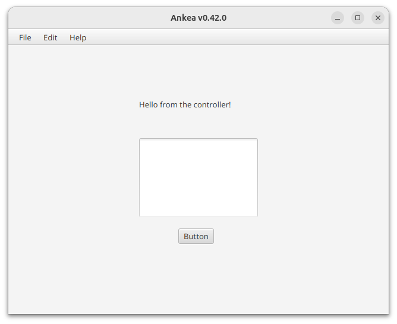

# History of the Creation

Since I decided to use VS Code for this project, I had to bang my head against the wall for a while to get everything working. Note to self: never again.



**Image 1:** Spoiler alert. This image is the result of the multi-hour battle that I started when choosing VS Code over IntelliJ.

## Install and init

Commands that were run to set up the project were:

```bash
# Install SDKMAN!
curl -s "https://get.sdkman.io" | bash
source "$HOME/.sdkman/bin/sdkman-init.sh"

# Install Java 25 and Maven
sdk install java 25.0.2-tem
sdk install maven

# Create a new Maven project
cd ~/Code/$USER
mvn archetype:generate \
  -DgroupId=fi.jyu.ohj2.sourander.ankea \
  -DartifactId=ankea \
  -DarchetypeArtifactId=maven-archetype-quickstart \
  -DarchetypeVersion=1.5 \
  -DinteractiveMode=false
cd ankea
```

## POM settings

For VS Code, install the [Extension Pack for Java](https://marketplace.visualstudio.com/items?itemName=vscjava.vscode-java-pack) by Microsoft.

After this, the `pom.xml` was edited to add JavaFX dependencies and set the Java version to 25. I copy-pasted most of the JavaFX dependencies from the IDEA project. I suppose I could've used some `javafx-fxml-template` to do scaffolding, but... yeah. This works too.

## VS Code Settings

For this, I referred to [Java Development Setup, SDKMAN, Gradle, VS Code](https://mikyan.net/blog/java-development-setup/) guide by Mikyan.

## Justfile

I had some problems with the `Run` and `Debug` buttons in VS Codes code editor view. They appeared only in the preset `App.java` file, but not in the test file nor my actual `App.java` file.

CLI is king anyways, so I created a `Justfile` to run the app and tests with just `just run` and `just test` commands.

## Java to Docs

I used [Dokka CLI](https://kotlinlang.org/docs/dokka-cli.html) to generate documentation from the Java code. I tried getting the Maven plugin to work, but had to give up after a while. CLI worked fine, although I cannot find proper documentation for the GFM plugin. Having that said, the site states that it is *experimental*, so I guess that is to be expected.

> "For example, if you want to generate documentation in the experimental GFM output format, you need to download and pass gfm-plugin's JAR (download) into the pluginsClasspath configuration option."

The output is ugly, but I decided to keep it anyway.

## Time spent

This took surprisingly long time, around 4 hours. I had to use Gemini 3.1 Pro to help me out in tough spots. It did manage to give me good advice on e.g. the `pom.xml` dependencies, which saved me some time, as well as copying the JavaFX dependencies from the IDEA project. However, the Justfile and the Dokka related tips were **surprisingly horrible**, even if I gave it a fair amount of context from the official docs.
