# User Guide

Welcome to the user guide for Ankea! We wish you have a truly Ankea moment with this guide and this app. After this short 1 hour read, you can apply for certification as an Ankea Expert and get a shiny badge to show off on your social media profiles (valid for 1 months, then you have to reapply due to somewhat unstable UI).

This user guide has been written for a version `0.42.0` (codename Memorizing Marvin) of Ankea. This is the one of only version ever created. You can install it by

```bash
git clone https://github.com/sourander/ankea && cd ankea
just run
```

!!! info "Prerequisites"

    You need to have Java 25 (or higher) installed on your machine to run Ankea. You can install it using e.g. [SDKMAN](https://sdkman.io/).

    Also, you need to have Just installed, which can be installed using [most package managers](https://just.systems/man/en/packages.html).

    For Windows users: easiest option to improve the quality of life is starting by installing your favorite Linux distribution and then following the instructions above.

## Decks Tab

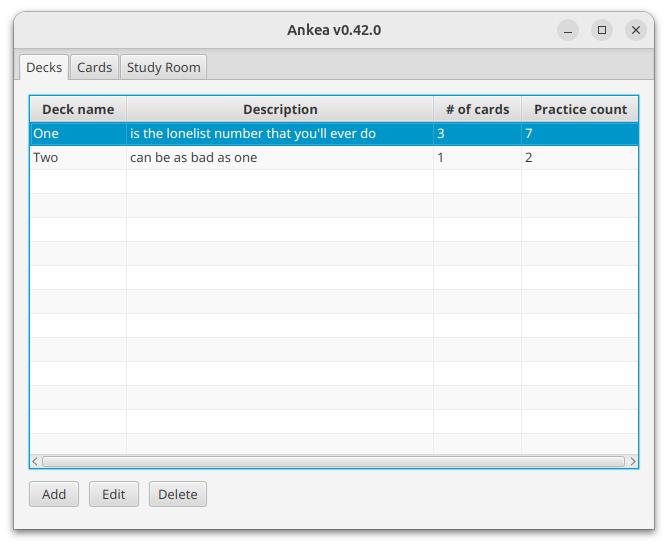

**Image 1:** The Decks tab, where you can view and manage your decks.

### Selecting a Deck

Selecting a Deck is as simple as clicking on the deck you want to select. The selected deck will be highlighted in blue. In the Image 1 above, the deck named *One* is selected.

### Adding a Deck

To add a deck, click the "Add Deck" button. This will open a dialog where you can enter the Header of your new deck.

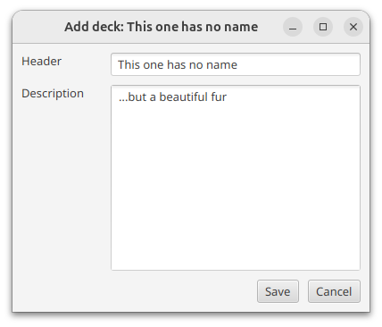

**Image 2:** The "Add Deck" dialog, where you can enter the Header of your new deck. Default Header is shown in the image.

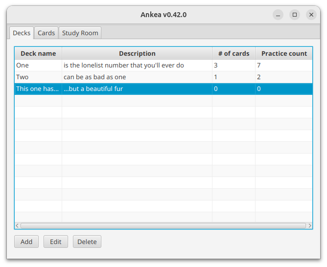

**Image 3:** The Decks tab with a new deck added.


### Editing a Deck

To edit a deck, select the deck you want to edit and click the "Edit Deck" button. This will open a dialog where you can change the Header and the Description of the selected deck.

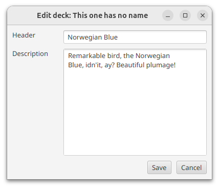

**Image 4:** The "Edit Deck" dialog, where you can change the Header and the Description of the selected deck.

### Deleting a Deck

To delete a deck, select the deck you want to delete and click the "Delete Deck" button. There is no confirmation dialog. Only destruction.

## Cards Tab

Once you have selected a deck you fancy, you can click on the "Cards" tab to view and manage the cards in that deck.

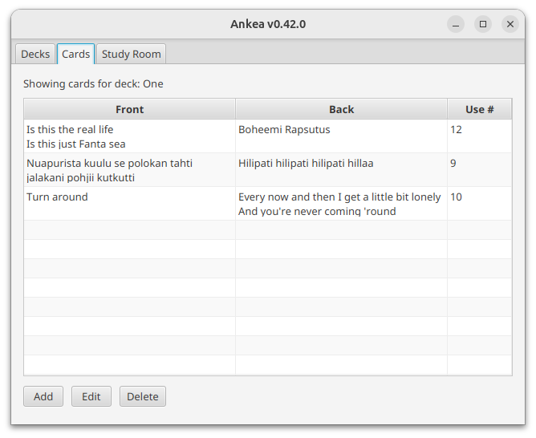

**Image 5:** The Cards tab, where you can view and manage the cards in the selected deck.

### Selecting a Card

This behaviour is the same as selecting a deck. Just click on the card you want to select and it will be highlighted in blue. In the Image 5 above, no card is selected.

### Adding a Card

To add a card, click the "Add Card" button. This will open a dialog where you can enter the Front and the Back of your new card.

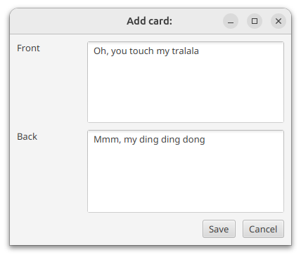

**Image 6:** The "Add Card" dialog.

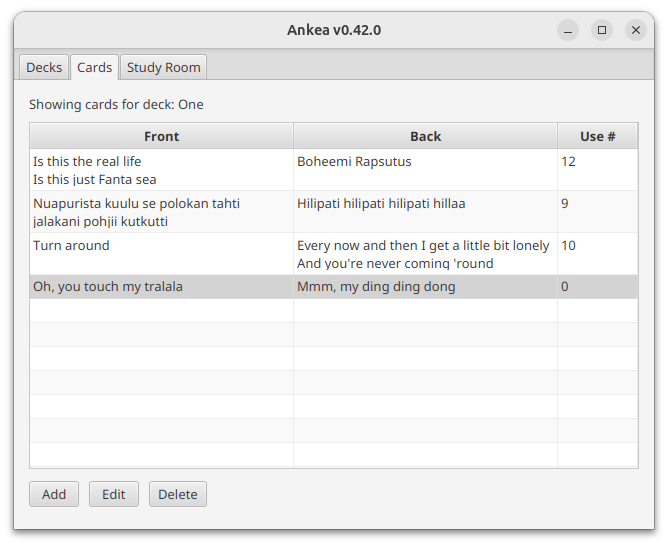

**Image 7:** And... tralala, a new card has been added to the deck.

### Editing a Card

To edit a card, select the card you want to edit and click the "Edit Card" button. This will open the same dialog as adding a card, but with the Front and the Back of the selected card already filled in. You can change them as you wish.

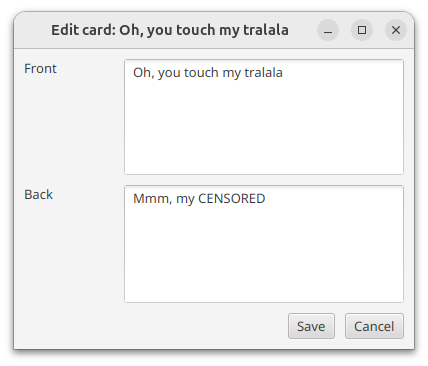

**Image 8:** The "Edit Card" dialog, where you can change the Front and the Back of the selected card.

### Deleting a Card

To delete a card, select the card you want to delete and click the "Delete Card" button. There is no confirmation dialog. Only destruction. The ding ding dong is no more.

## Study Room Tab

To start rote learning and enjoy the joys of memorizing things so that you can forget them after the exam, click on the "Study Room" tab. Only Practice Sesssion is implemented for now. The Exam Session is coming soon ($9.99/month or $1999.99/year).

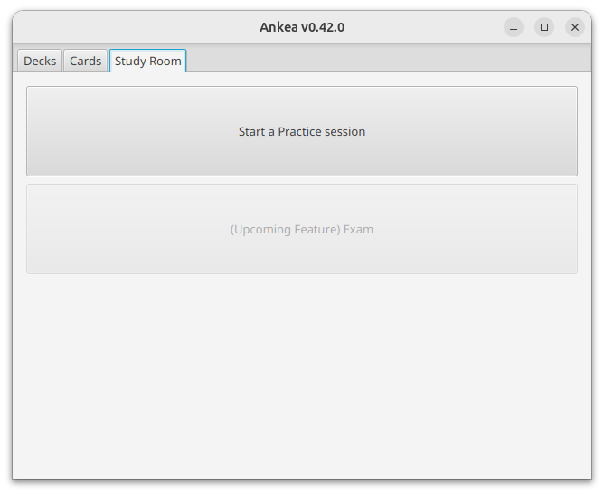

**Image 9:** The Study Room tab, where you can start a Practice Session.

### Practice Session

After pressing the button that has the text *Start a Practice Session* button in large friendly letters, you will be taken to the Practice Session screen. The session will show you all the happy little cards in a random order. It is random, but persisted during the session. The practice session is automatically recorded, as is revealing any card's back. These statistics are shown in the previously mentioned Deck and Card Tabs.

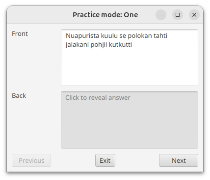

**Image 10:** The Practice Session screen, you can try to remember the back of the card and then click on the card to reveal it. Did you get it right?

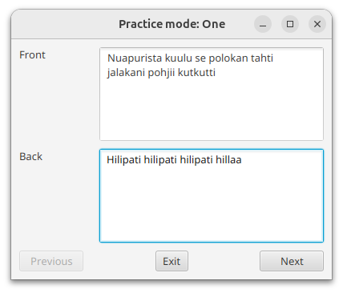

**Image 11:** After clicking the reveal button, hotkey SPACE, you will be shown the back of the card. Now, if you didn't remember *"Hilipati hilipati hilipati hillaa"*, you can improve your behavioristic learning experience by giving yourself a good old electric shock.

### Hotkeys

These hotkeys are available in the Practice Session:

* LEFT ARROR: Previous card ("go left")
* RIGHT ARROW: Next card ("go right")
* SPACE: Reveal
